# 3η Εργασία Αρχιτεκτονικής Υπολογιστών (Ομάδα 2)

_Ραφαήλ Μπουλογεώργος, ΑΕΜ: 9186_

_Παύλος Φραγκιαδουλάκης, ΑΕΜ: 8389_

## Βήμα 1ο - Εξοικείωση με τον εξομοιωτή McPAT

Το McPAT αποτελεί έναν εξομοιωτή ισχύος, χώρου, και χρονισμού συμβατό με πολυνηματικές και πολυπύρηνες αρχιτεκτονικές. Περιλαμβάνει τα μοντέλα επεξεργαστών, το δίκτυο επικοινωνίας, την κοινόχρηστη κρυφή μνήμη Cache και τους ελεγκτές μνήμης για να μπορέσει να εξάγει συμπεράσματα για τον χρονισμό, την έκταση του επεξεργαστή, την απαιτούμενη ισχύ για διάφορες τεχνολογίες από 90 nm μέχρι 20 nm ([HP - McPAT](https://www.hpl.hp.com/research/mcpat/)).

Για την εγκατάσταση του McPAT ακολουθήθηκαν τα παρακάτω βήματα με βάση την διατύπωση της εργασίας:
1. Δημιουργήθηκε κλώνος του McPAT repository:

```bash
git clone https://github.com/kingmouf/cmcpat.git my_mcpat
```
2. Προστίθενται οι απαραίτητοι μεταγλωττιστές εφόσον δεν υπάρχουν:

```bash
#32-bit
sudo apt install libc6-dev-i386
#64-bit
sudo apt install g++-multilib
sudo apt install gcc-7-multilib g++-7-multilib
```
3. Μεταγλώτισση με make
```bash
cd my_mcpat/mcpat
make
```

### Ερώτημα 1ο

Για την διερεύνηση των αποτελεσμάτων εξόδου, εκτελέστηκε το McPAT για τον επεξεργαστή *Xeon*, η περιγραφή του οποίου βρίσκεται στον υποφάκελο *ProcessorDescriptionFiles* για το μέγιστο επίπεδο ανάλυσης (*print_level = 5*):
```bash
./mcpat -infile ProcessorDescriptionFiles/Xeon.xml -print_level 5
```
Παρακάτω συνοψίζονται τα αποτελέσματα της προσομοίωσης με τον McPAT για τον Xeon επεξεργαστή ([Xeon - McPAT results](/src/McPAT_output/Xeon.txt))

- Τεχνολογία Τρανζίστορ : [65 nm](/src/McPAT/Xeon.txt#L6)

**Κατανάλωση Ισχύος Επεξεργαστή**
- Peak Power            : [134.938 W](/src/McPAT_output/Xeon.txt#L14)
- Total Leakage         : [36.8319 W](/src/McPAT_output/Xeon.txt#L15)
  - Subthreshold Leakage  : [35.1632 W](/src/McPAT_output/Xeon.txt#L17)
  - Gate Leakage          : [1.66871 W](/src/McPAT_output/Xeon.txt#L19)
- Peak Dynamic          : [98.1063 W](/src/McPAT_output/Xeon.txt#L16)
  - Runtime Dynamic     : [72.9199 W](/src/McPAT_output/Xeon.txt#L20)

**Dynamic Power και Leakage Power**

Η Κατανάλωση Ισχύος σε ένα ολοκληρωμένο κύκλωμα χωρίζεται σε 2 κατηγορίες: την στατική κατανάλωση ισχύος (Static Power dissipation ή Power Leakage) και την δυναμική κατανάλωση ισχύος (Dynamic power dissipation). Την ενέργεια αυτή την καταναλώνει κάθε διακόπτης για να αλλάξει (dynamic) ή για να διατηρήσει (static) την κατάσταση που βρίσκεται (on ή off).

Η **Στατική κατανάλωση ισχύος** ή **Leakage Power** αναφέρεται στην μέση ισχύ που απαιτεί ένας διακόπτης/τρανζίστορ για να βρίσκεται σε λειτουργία. Θεωρητικά εντοπίζεται ροή ρεύματος μόνο μεταξύ της πηγής και του εκπομπού του τρανζίστορ, όμως στην πράξη, υπάρχουν μικρά ρεύματα από την πύλη (Gate leakage) και από το υπόστρωμα (Subthreshold leakage) που καταναλώνουν ενέργεια *ανάλογη της τάσης τροφοδοσίας, της τάσης κατωφλίου και του λόγου W/L* δηλαδή των μεγεθών του τρανζίστορ. Η ενέργεια αυτή καταναλώνεται ακόμα και στην αλλαγή της κατάστασης του διακόπτη και για αυτό ονομάζεται Στατική.  

Η **Δυναμική Κατανάλωση** ισχύος είναι η μέση ενέργεια ανά μονάδα χρόνου που χρειάζεται κατά την αλλαγή της κατάστασης του ο αντιστροφέας και οφείλεται στην ύπαρξη ροής ρεύματος διαμέσου του διακόπτη για την φόρτιση και την εκφόρτιση του χωρητικού φορτίου αλλά και εξαιτίας των ρευμάτων βραχυκύκλωσης που δημιουργούνται στο εσωτερικό των τρανζίστορ του διακόπτη. Αυτά τα ρεύματα αναγκάζουν τους διακόπτες να καταναλώνουν ενέργεια που η οποία ανά μονάδα χρόνου ονομάζεται Δυναμική κατανάλωση Ισχύος. Αυτή η ισχύς αυξάνεται με την αύξηση της συχνότητας του ρολογιού, την τάση τροφοδοσίας και της χωρητικότητας του τρανζίστορ σύμφωνα με την εξίσωση *P=f · C· V<sup>2</sup>* ανά κύκλο. Οι νέες τεχνολογίες μικραίνουν την τάση τροφοδοσίας, αλλά οι απαιτήσεις για μεγάλη συχνότητα μπορούν να αυξήσουν την ισχύ αυτή σημαντικά.

Πηγές:
- *Sedra, A.S. & Smith, K.C. (1982) Microelectronic Circuits, Seven Edition, p.1149*
- *[McPAT Research](https://www.hpl.hp.com/research/mcpat/micro09.pdf)*
- *[Semiconductor Engineering](https://semiengineering.com/knowledge_centers/low-power/low-power-design/power-consumption/)*

Επειδή η ισχύς είναι εκφρασμένη σε ενέργεια ανά μονάδα χρόνου, δεν έχει σημασία η χρονική διάρκεια εκτέλεσης του προγράμματος.

### Ερώτημα 2ο (Energy Efficiency)
**Ενεργειακή Απόδοση** είναι η διεκπεραιωτική ικανότητα μιας αρχιτεκτονικής ανά μονάδα ισχύος δηλαδή Performance per Watt [1]. Ο λόγος αυτός είναι το μέτρο σύγκρισης συστημάτων με διαφορετική υπολογιστική ισχύ και κατανάλωση. Μπορούμε να θεωρήσουμε για ένα σύστημα τον όρο διεκπεραιωτική ικανότητα ώς τον λόγο των εντολών που εκτελεί προς τον χρόνο:

**Energy_efficiency = (Instructions/seconds)/(Power [Watt]) = Instructions/(Energy [J])**

Πηγές:
- *[1] Patterson, D A. & Hennessy, J L. (1998) Computer Organization and Design, Fifth Edition, p.49*
- [Wikipedia - Performance per watt](https://en.wikipedia.org/wiki/Performance_per_watt)

Επομένως, σε ένα εξεταζόμενο πρόγραμμα/σύστημα δεν επαρκεί η γνώση της ισχύος για κάθε επεξεργαστή· χρειάζεται ο αριθμός των εντολών που εκτελεί ο επεξεργαστής προς στην συνολική ενέργεια που καταναλώνει ή εναλλακτικά ο ρυθμός εκτέλεσης των εντολών προς την ισχύ.

Στο εξεταζόμενο υποερώτημα, δίνεται ότι οι ισχείς κατανάλωσης σε δύο επεξεργαστές είναι ίσες με *P<sub>1</sub> = 5 W* και *P<sub>2</sub> = 40 Watt* αντίστοιχα. Για να έχουμε καλύτερη ενεργειακή απόδοση (*η*) στον δεύτερο επεξεργαστή θα πρέπει να ισχύει:

*η<sub>2</sub> > η<sub>1</sub>* ή 

*(Instructions/t<sub>2</sub>)/P<sub>2</sub> > (Instructions/t<sub>1</sub>)/P<sub>1</sub>* ή 

*t<sub>1</sub>/t<sub>2</sub> > P<sub>2</sub>/P<sub>1</sub>* ή 

*t<sub>1</sub>/t<sub>2</sub> > 8*

Άρα αρκεί ο δεύτερος επεξεργαστής να είναι πάνω από 8 φορές πιο γρήγορος από τον πρώτο (προκειμένου να έχει καλύτερη ενεργειακή απόδοση ο δεύτερος από τον πρώτο).

Τα αποτελέσματα του McPAT περιέχουν στοιχεία για την συχνότητα λειτουργίας, την τεχνολογία των τρανζίστορ της συνολικής αρχιτεκτονικής και επιπλέον την κατανάλωση ισχύος, και την επιφάνεια που καταλαμβάνουν τα επιμέρους στοιχεία του συστήματος. Έτσι μπορούμε να βγάλουμε συμπεράσματα για την ισχύ που απαιτεί η συγκεκριμένη αρχιτεκτονική, χωρίς όμως να έχουμε πληροφορίες σχετικά με τον χρόνο προσομοίωσης και τις εντολές που εκτέλεσε στο διάστημα αυτό. Δεν είμαστε έτσι σε θέση να βγάλουμε συμπεράσματα για την ενεργειακή απόδοση της αρχιτεκτονικής που προσομοιώνει το McPAT.

### Ερώτημα 3ο (Σύγκριση Xeon/ARM A9)

Για την σύγκριση με τον ARM X9 εκτελούμε αντίστοιχα για το αντίστοιχο infile αρχείο:

```bash
./mcpat -infile ProcessorDescriptionFiles/ARM_A9_2GHz.xml -print_level 5
```
Τα συγκριτικά αποτελέσματα για τους δύο επεξεργαστές συνοψίζονται στον παρακάτω πίνακα:

Κατανάλωση Ισχύος Επεξεργαστή | Xeon | ARM A9 (2 GHz)
------------------------------|------|-------
Total leakage | [36.8319 W](/src/McPAT_output/Xeon.txt#L15) | [0.108687 W](/src/McPAT_output/Arm_A9_2Ghz.txt#L15)
Runtime Dynamic  | [72.9199 W](/src/McPAT_output/Xeon.txt#L20) | [2.96053 W](/src/McPAT_output/Arm_A9_2Ghz.txt#L20)

Μπορούμε να μελετήσουμε την απόδοση αυτή σε 2 κατηγορίες ανάλογα με την κατανάλωση  Dynamic Power και Leakage Power:
Αναφερόμενοι στο **Dynamic Power** ο Xeon απαιτεί περίπου 25 φορές περισσότερη ισχύ Runtime Dynamic Power, δηλαδή καταναλώνει 25 φορές περισσότερο κατά την διάρκεια που εκτελείται η εφαρμογή, σε σχέση με τον ARM. Αφού ο Xeon έχει 40 φορές μεγαλύτερη υπολογιστική ισχύ, η ενεργειακή απόδοση του Xeon κατά την εκτέλεση του προγράμματος είναι *(40 / 72.92) x 36.83 = 20* φορές καλύτερη σε σχέση με τον ARM Α9.  Θεωρούμε ότι στην διάρκεια εκτέλεσης του προγράμματος η στατική κατανάλωση είναι μικρή και δεν την λαμβάνουμε υπόψιν.

Το σύστημα δεν τερματίζει μετά το πέρας του προγράμματος, άρα για να βγάλουμε συμπεράσματα για την ενεργειακή απόδοση χρειάζεται να λάβουμε υπόψιν και το Leakage Power. Αυτή η ισχύς απαιτείται σε όλη την διάρκεια λειτουργία του συστήματος έτσι για τον Xeon είναι περίπου *36.83 W / 0.11 W = 360* φορές μεγαλύτερη από τον ARM A9. Έτσι βλέπουμε ότι ο Xeon καταναλώνει πολύ περισσότερη ενέργεια για τον ίδιο χρόνο λειτουργίας σε σχέση με τον ARM Α9. Επομένως, παρότι ο Xeon έχει καλύτερο Energy Efficiency κατά την εκτέλεση του προγράμματος δεν μπορεί να είναι πιο αποδοτικός από τον ARM Α9 για ένα σύστημα που δεν τερματίζει μετά την λήξη της εφαρμογής.

## Βήμα 2ο - gem5 + McPAT

Για πρακτικούς λόγους δίνουμε δικαιώματα εκτέλεσης στο Python script το οποίο θα μετατρέψει το αρχείο stats του gem5 σε μορφή συμβατή με το McPAT:

```bash
chmod +x ./my_mcpat/Scripts/GEM5ToMcPAT.py
```

```bash
./Scripts/GEM5toMcPAT.py <gem5 stats file> <gem5 config file (json)> ./mcpat/ProcessorDescriptionFiles/inorder_arm.xml -o Gem5ToMcPat.xml
```

Από την δεύτερη εργασία χρησιμοποιούμε τα αποτελέσματα του [Gem5](/src/Gem5_output/Benchmarks_results/) και με την παραπάνω εντολή δημιουργούμε αρχεία xml για την εκτέλεσή του στον McPat. Για λόγους ευκολίας και ταχύτητας δημιουργήθηκε το παρακάτω bash script:

[GEM5ToMcPAT.sh](/src/Gem5ToMcPAT/GEM5ToMcPAT.sh)

Το script αυτό παίρνει ως πρώτο όρισμα το φάκελο όπου βρίσκονται τα αποτελέσματα του Gem5. Έχει την δυνατότητα να διαβάσει όλους τους υποφακέλους και να δημιουργήσει σε έναν νέο φάκελο, που προαιρετικά μπαίνει ως δεύτερο όρισμα, τα αντίστοιχα αρχεία xml. Είναι αναγκαίο να βρίσκεται στον φάκελο *my_mcpat* δηλαδή στο (cloned) repository που φτιάξαμε για το McPAT. 
*Το script μπορεί να δεχτεί και ένα 3ο όρισμα που αφορά το όνομα του φακέλου που θα εκτυπωθούν τα αποτελέσματα από τον προσομοιωτή McPAT με είσοδο τα xml που δημιουργήθηκαν προηγουμένως. Εάν δεν δοθεί το όρισμα αυτό δεν εκτελείται η προσομοίωση.*

Τα βήματα που ακολουθήθηκαν είναι τα εξής:
- Δημιουργούμε όλα τα xml στο φάκελο *src/McPAT_output/Benchmarks_results_xml/<benchmark_name>_McPAT/<Benchmark_name>.xml*
- Τρέχουμε για όλα τα xml το McPAT και αποθηκεύουμε τα αποτελέσματα σε αντίστοιχους υποφακέλους:  *./src/McPAT_output/Benchmarks_results_McPAT/<benchmark_name>_McPAT/<Benchmark_name>.txt*
- Το script εκτελείται με την παρακάτω εντολή, ενώ όλα τα errors αποθηκεύονται στο *./GEM5ToMcPAT_errors* :
 
 ```[DIR: ./GEM5ToMcPat.sh ./src/Gem5_output/Benchmarks_results/<Benchmark_name>  ./src/McPAT_output/Benchmarks_results_xml/<Benchmark_name> ./src/McPAT_output/Benchmarks_results_McPAT/<Benchmark_name>]
 ```

### Ερώτημα 1ο

Για να βγάλουμε αποτελέσματα για το EDAP ( Energy – Delay – Area ) χρειαζόμαστε τα στατιστικά και των 2 προσομοιώσεων:
-	**Energy** : Θα πάρουμε τα αποτελέσματα από την έξοδο του McPAT και όπως αναφέρει η εκφώνηση αφορά τα μεγέθη Runtime Dynamic, Subthreshold Leakage και Gate Leakage. Αυτά τα νούμερα αναφέρονται στην μέση ισχύ. Παρόλα αυτά, χρησιμοποιώντας το Delay όπως ορίζεται παρακάτω μπορούμε να βρούμε και τη συνολική μέση ενέργεια που κατανάλωσε το σύστημα για το συγκεκριμένο Benchmark.
-	**Delay**: Την παράμετρο αυτή θα την βρούμε στο stats του Gem5 και εξάγεται από την τιμή *sim_seconds*.
-	**Area**: Θα την βρούμε στην έξοδο του McPAT στα αντίστοιχα πεδία *Area*.
- Για την τιμή του **Energy Efficiency** θα λάβουμε υπόψιν τον λόγο 1/[sim_seconds*(Runtime Dynamic + Total Leakage]) για κάθε προσομοίωση που έγινε με το ίδιο Benchmark. Αυτό το κάνουμε γιατί όλες οι αρχιτεκτονικές εκτέλεσαν τον ίδιο κώδικα (άρα παραλείπουμε το Instructions στον αριθμητή). Έτσι μπορούμε να συγκρίνουμε πιο είναι ενεργειακά αποδοτικότερο για τη συγκεκριμένη εφαρμογή κάθε φορά.

### Ερώτημα 2ο

Τα αποτελέσματα βρίσκονται στο φάκελο ./src/Energy_results με τα αντίστοιχα ονόματα από κάθε Benchmarks.

Για την εύρεση της επίπτωσης στην απόδοση στις διάφορες παραμέτρους που εξετάζουμε, τα παρακάτω εύρη που αναφέρονται παρακάτω. Να σημειωθεί ότι το μέγεθος των Data/Instruction για την L1 είναι επιλεγμένο έτσι ώστε να το άθροισμά τους να μην υπερβαίνει τα 256 kB:
  * Cacheline Size: 32, **64**, 128
  * L1 Data Size [kB]: 16, **32**, 64, 128
  * L1 Instruction Size [kB]: 16, 32, **64**, 128
  * L1 Data Associativity: **1**, 2, 4
  * L1 Instruction Associativity: **1**, 2, 4
  * L2 Data Associativity: 1, **2**, 4
  * L2 Size [kB]: **512**, 1024, 2048, 4096  
  
Στα παραπάνω, με έντονη γραμματοσειρά σημειώνονται οι default τιμές. 
Ο αριθμός των instructions που εκτελέστηκε είναι ίσος με 10<sup>8</sup>, γεγονός που επηρέασε τη μη σημαντική επίπτωση των μεταβολών του L1 instruction size, το οποίο θα ήταν αναμενόμενο. 

Παρακάτω παρατίθενται τα χαρακτηριστικά γραφήματα για τις παραπάνω περιπτώσεις, στις οποίες παρουσιάζεται κάποια αξιοσημείωτη μεταβολή στις παραμέτρους εξόδου: Area/Power/Energy Efficiency. Το Power παρακάτω αναπαρίσταται ως Total (Total Leakage + Runtime Dynamic) και vw Peak, προκειμένου να υπάρχει μία αίσθηση της διαφοράς της επίπτωσης στις μέσες και στις ακραίες τιμές της ισχύος. Το Energy Efficiency, όπως αναφέρεται παραπάνω είναι εκφρασμένο ανά μονάδα Instructions, ώστε να απλοποιείται η σύγκριση μεταξύ των σεναρίων. Ειδικά στο spechmmer, υπάρχει ένας επιπλέον πολ/σμός με έναν παράγοντα 0.0005, για την διευκόλυνση της απεικόνισης στο ίδιο γράφημα.

#### CACHE LINE
Το μέγεθος του Cache Line φαίνεται να επηρεάζει σχεδόν όλα τα μεγέθη ενδιαφέροντος.
* Cache Line effect to Power
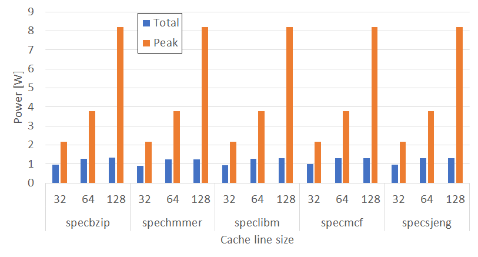

Παρατηρούμε ότι υπάρχει σημαντική αύξηση του Peak Power με την αύξηση του block size και όχι τόσο στο Total Power.

* Cache Line effect to Area
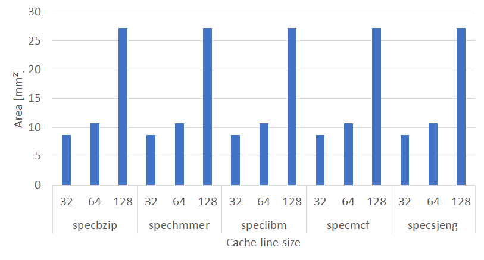

Η επίπτωση του block size στο Area είναι σημαντική κυρίως στη μετάβαση από 64 kB στα 128 kB.

* Cache Line effect to Energy Efficiency
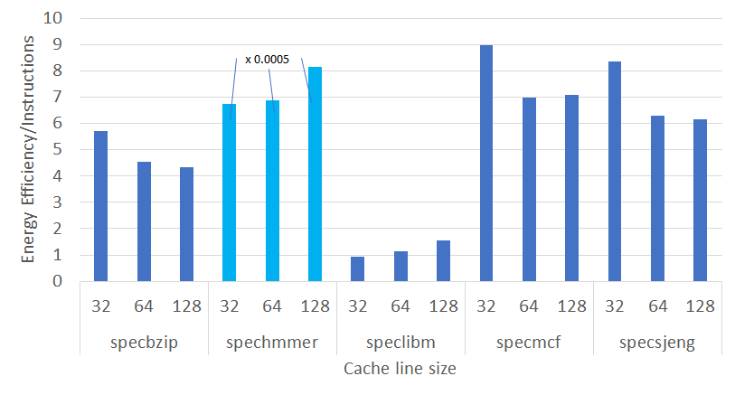

Στα spechmmer και speclibm βλέπουμε μία μικρή αύξηση στο ανηγμένο efficiency, ενώ στα specbzip, specmcf, specsjeng έχουμε μείωση του efficiency καθώς αυξάνεται το block size.

#### L1D size/L1I size

* L1D size/L1I size effect to Power
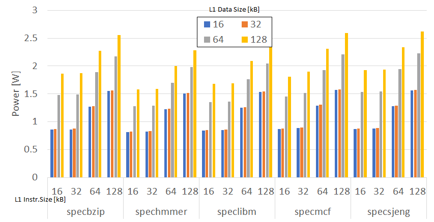

Η επίπτωση του L1 Instruction Size, καθώς και του L1 Data Size δεν είναι σημαντική για τα μεγέθη 16 kB/32 kB, ενώ έπειτα το Power αυξάνει σημαντικά στα 64 kB/128 kB και στις δύο περιπτώσεις (L1 Instruction και L1 Data Size). Τα συμπεράσματα είναι κοινά για όλα τα benchmarks.

* L1D size/L1I size effect to Area
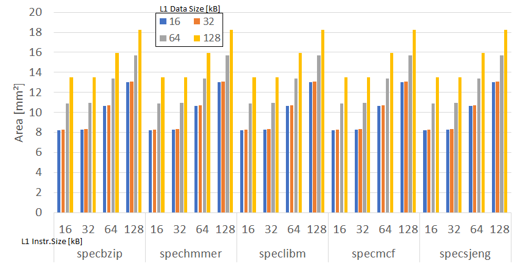

Η επίπτωση του L1 Instruction Size, καθώς και του L1 Data Size δεν είναι σημαντική για τα μεγέθη 16 kB/32 kB, ενώ έπειτα το Area αυξάνει σημαντικά στα 64 kB/128 kB και στις δύο περιπτώσεις (L1 Instruction και L1 Data Size). Τα συμπεράσματα είναι κοινά για όλα τα benchmarks.

* L1D size/L1I size effect to Efficiency
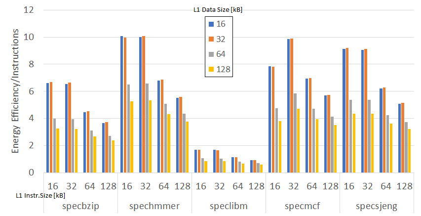

Βλέπουμε ότι σε όλες τις περιπτώσεις του L1 Data Size/L2 Data Size το ανηγμένο efficiency είναι μεγαλύτερο στα 16 kB/32 kB (όπου οι τιμές είναι περίπου ίδιες).

#### L1D associativity

* L1D associativity effect to Power
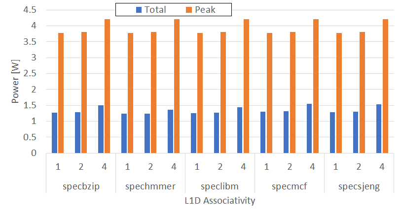

To Power (Peak) φαίνεται να αυξάνεται λίγο περισσότερο κυρίως στη μετάβαση από 2 σε 4 σε όλα τα benchmarks.

* L1D associativity effect to Area
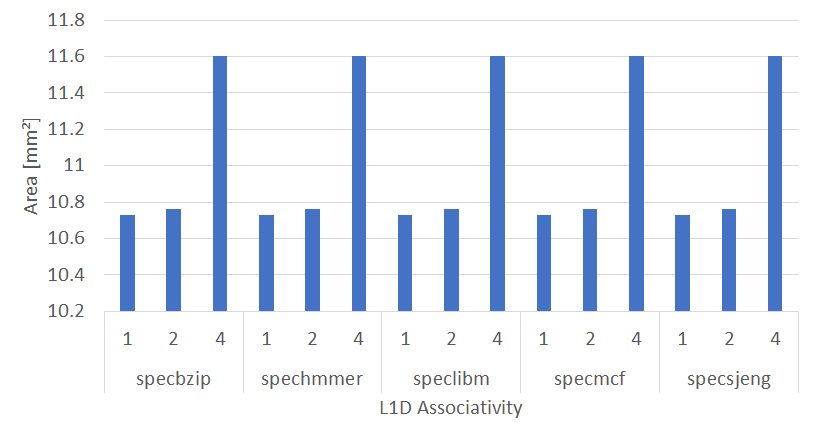

To Area φαίνεται να αυξάνεται σημαντικά κυρίως στη μετάβαση από 2 σε 4 σε όλα τα benchmarks.

* L1D associativity effect to Efficiency
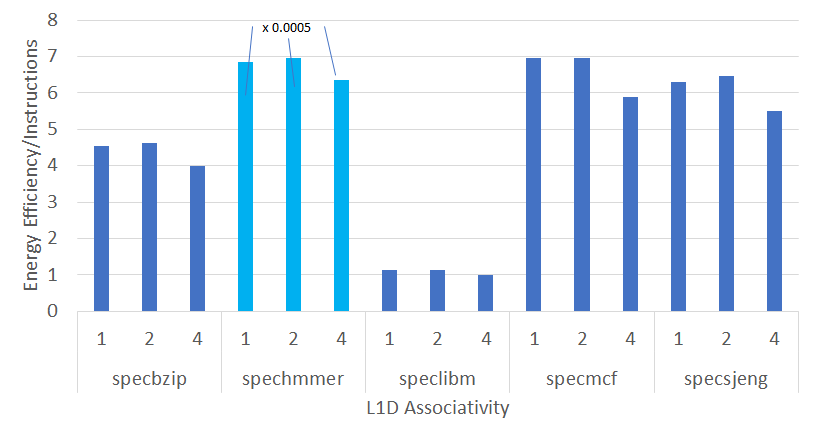

To efficiency φαίνεται να είναι υψηλότερο στις περιπτώσεις όπου το associativity παίρνει τις τιμές 1 και 2 (για όλα τα benchmarks).

#### L1I associativity

* L1I associativity effect to Power


To Power (Peak) φαίνεται να πέφτει λίγο περισσότερο κυρίως στη μετάβαση από 2 σε 4 σε όλα τα benchmarks.

* L1I associativity effect to Area
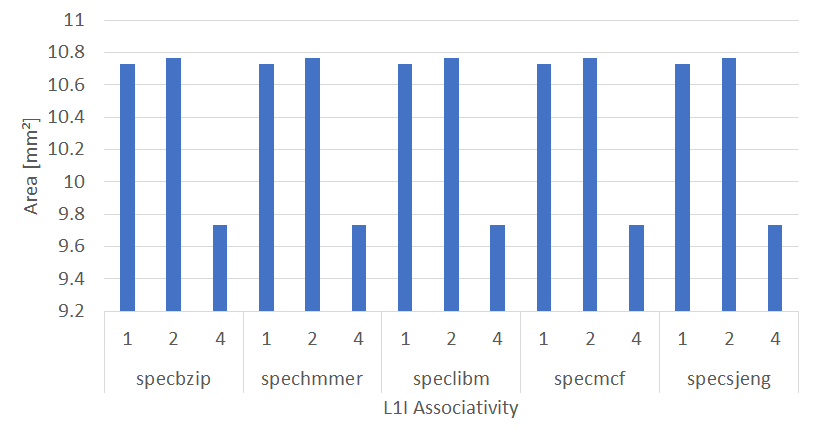

To Area φαίνεται να πέφτει κατά τη μετάβαση από 2 σε 4 σε όλα τα benchmarks.

* L1I associativity effect to Efficiency
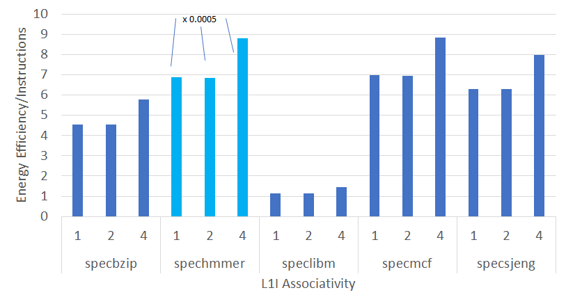

To efficiency φαίνεται να είναι υψηλότερο στις περιπτώσεις όπου το associativity παίρνει την τιμή 4 (για όλα τα benchmarks).

#### L2D associativity

* L2D associativity effect to Power
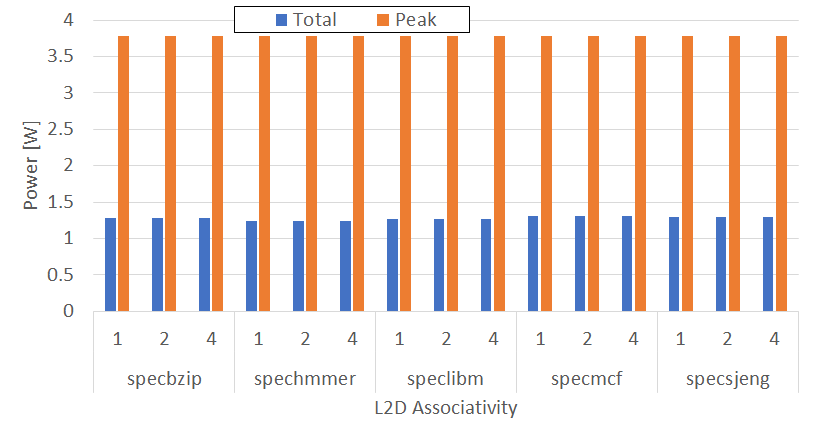

To Power (Peak+Total) φαίνεται να μην επηρεάζεται σημαντικά σε όλα τα benchmarks.

* L2D associativity effect to Area
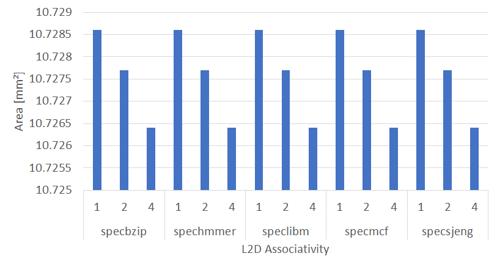

To Area φαίνεται να μην επηρεάζεται σημαντικά σε όλα τα benchmarks.

* L2D associativity effect to Efficiency
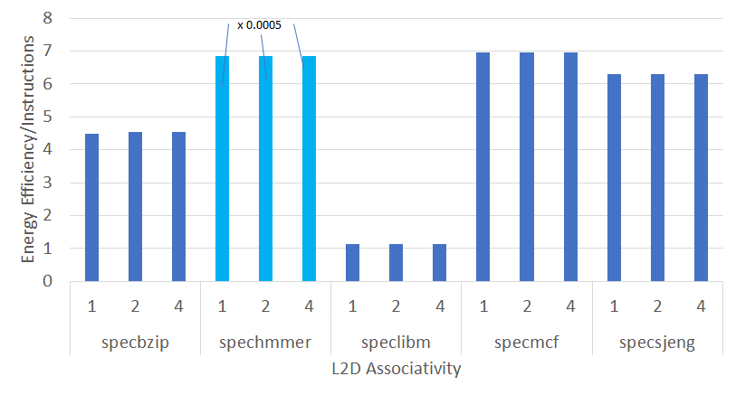

To efficiency δεν φαίνεται να επηρεάζεται από το L2D associativity (για όλα τα benchmarks).

#### L2 size [kB]

* L2 size effect to Power
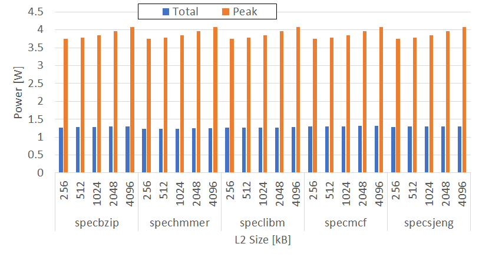

To Power (Peak) φαίνεται να αυξάνεται ελαφρώς με την αύξηση του L2 size.

* L2 size effect to Area
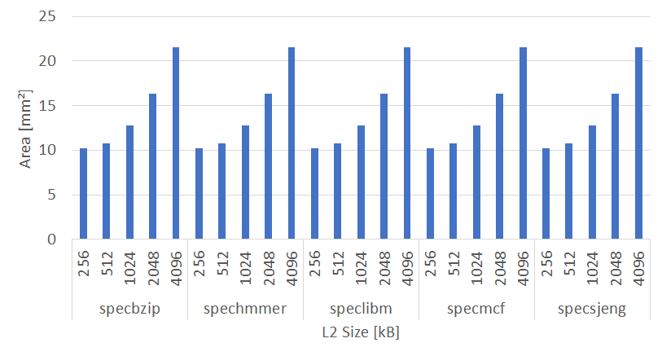

To Area φαίνεται να αυξάνεται σημαντικά για L2 size &ge; 1 MB.

* L2 size effect to Efficiency
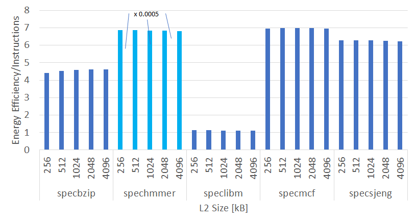

To efficiency δεν φαίνεται να επηρεάζεται συνολικά λόγω μεταβολής του L2 size (για όλα τα benchmarks).

### Ερώτημα 3ο

Για την αξιοποίηση της πληροφορίας που παίρνουμε από τους παραπάνω υπολογισμούς για κάθε benchmark χρησιμεύει ένας δείκτης που να λαμβάνει υπόψη τη συνδυασμένη πληροφορία του Efficiency και το Area, για αυτό παίρνουμε τον δείκτη *Index = Efficiency/Area*. Ο δείκτης μεγαλώνει όταν μεγαλώνει το Efficient και όταν μικραίνει το Area, άρα το βέλτιστο σενάριο για κάθε benchmark θα καθοριστεί από τη μεγιστοποίηση αυτού του δείκτη.

Έτσι παράγεται ο παρακάτω πίνακας ο οποίος είναι ταξινομημένος ανά benchmark και ανά φθίνουσα τιμή του εν λόγω δείκτη Index:

| Benchmarks                      | Cache line | L1 Data Size [kB] | L1 Instr Size [kB] | L1 Data Assoc | L1 Instr Assoc | L2 Data Assoc | L2 Size [kB] | Energy Efficiency | Area [mm²] | INDEX=EFFICIENCY/AREA |
|---------------------------------|------------|-------------------|--------------------|---------------|----------------|---------------|--------------|-------------------|------------|-----------------------|
| ./specbzip/l1d.32kB_l1i.16kB    | 64         | 32                | 16                 | 1             | 1              | 2             | 512          | 6.690843047       | 8.29118    | 0.806983209           |
| ./specbzip/l1d.16kB_l1i.16kB    | 64         | 16                | 16                 | 1             | 1              | 2             | 512          | 6.593798251       | 8.2388     | 0.800334788           |
| ./specbzip/l1d.32kB_l1i.32kB    | 64         | 32                | 32                 | 1             | 1              | 2             | 512          | 6.6338943         | 8.3388     | 0.795545438           |
| ./specbzip/l1d.16kB_l1i.32kB    | 64         | 16                | 32                 | 1             | 1              | 2             | 512          | 6.537026578       | 8.28642    | 0.788884292           |
| ./specbzip/cacheline.32         | 32         | 32                | 32                 | 1             | 1              | 2             | 512          | 5.71493934        | 8.67246    | 0.658975578           |
| ./specbzip/l1i_assoc.4          | 64         | 32                | 32                 | 1             | 4              | 2             | 512          | 5.77282343        | 9.73057    | 0.593266729           |
| ./specbzip/l2_size.256kB        | 64         | 32                | 32                 | 1             | 1              | 2             | 256          | 4.408214291       | 10.1825    | 0.432920628           |
| ./specbzip/l1d_assoc.2          | 64         | 32                | 32                 | 2             | 1              | 2             | 512          | 4.610653036       | 10.7642    | 0.42833216            |
| ./specbzip/l2d_assoc.4          | 64         | 32                | 32                 | 1             | 1              | 4             | 512          | 4.542279987       | 10.7264    | 0.423467332           |
| ./specbzip/cpu_clock.1GHz       | 64         | 32                | 32                 | 1             | 1              | 2             | 512          | 4.537918404       | 10.7277    | 0.423009443           |
| ./specbzip/l1d.32kB_l1i.64kB    | 64         | 32                | 64                 | 1             | 1              | 2             | 512          | 4.537918404       | 10.7277    | 0.423009443           |
| ./specbzip/l1i_assoc.1          | 64         | 32                | 32                 | 1             | 1              | 2             | 512          | 4.537918404       | 10.7277    | 0.423009443           |
| ./specbzip/l1d_assoc.1          | 64         | 32                | 32                 | 1             | 1              | 2             | 512          | 4.537918404       | 10.7277    | 0.423009443           |
| ./specbzip/l2d_assoc.2          | 64         | 32                | 32                 | 1             | 1              | 2             | 512          | 4.537918404       | 10.7277    | 0.423009443           |
| ./specbzip/l2_size.512kB        | 64         | 32                | 32                 | 1             | 1              | 2             | 512          | 4.537918404       | 10.7277    | 0.423009443           |
| ./specbzip/cacheline.64         | 64         | 32                | 32                 | 1             | 1              | 2             | 512          | 4.537918404       | 10.7277    | 0.423009443           |
| ./specbzip/l1i_assoc.2          | 64         | 32                | 32                 | 1             | 2              | 2             | 512          | 4.530090209       | 10.7638    | 0.420863469           |
| ./specbzip/l2d_assoc.1          | 64         | 32                | 32                 | 1             | 1              | 1             | 512          | 4.494137804       | 10.7286    | 0.41889322            |
| ./specbzip/l1d.16kB_l1i.64kB    | 64         | 16                | 64                 | 1             | 1              | 2             | 512          | 4.455363134       | 10.6753    | 0.417352499           |
| ./specbzip/l1d.64kB_l1i.16kB    | 64         | 64                | 16                 | 1             | 1              | 2             | 512          | 3.982771169       | 10.9189    | 0.364759378           |
| ./specbzip/l1d.64kB_l1i.32kB    | 64         | 64                | 32                 | 1             | 1              | 2             | 512          | 3.963170542       | 10.9665    | 0.361388824           |
| ./specbzip/l2_size.1MB          | 64         | 32                | 32                 | 1             | 1              | 2             | 1024         | 4.58875845        | 12.81      | 0.358216897           |
| ./specbzip/l1d_assoc.4          | 64         | 32                | 32                 | 4             | 1              | 2             | 512          | 3.980753091       | 11.6039    | 0.343053033           |
| ./specbzip/l1d.32kB_l1i.128kB   | 64         | 32                | 128                | 1             | 1              | 2             | 512          | 3.716472457       | 13.0563    | 0.284649744           |
| ./specbzip/l2_size.2MB          | 64         | 32                | 32                 | 1             | 1              | 2             | 2048         | 4.604140278       | 16.3298    | 0.281947132           |
| ./specbzip/l1d.16kB_l1i.128kB   | 64         | 16                | 128                | 1             | 1              | 2             | 512          | 3.64383874        | 13.0039    | 0.280211224           |
| ./specbzip/l1d.128kB_l1i.16kB   | 64         | 128               | 16                 | 1             | 1              | 2             | 512          | 3.244904441       | 13.4804    | 0.240712771           |
| ./specbzip/l1d.128kB_l1i.32kB   | 64         | 128               | 32                 | 1             | 1              | 2             | 512          | 3.232167054       | 13.528     | 0.238924235           |
| ./specbzip/l1d.64kB_l1i.64kB    | 64         | 64                | 64                 | 1             | 1              | 2             | 512          | 3.119289001       | 13.3554    | 0.233560133           |
| ./specbzip/l2_size.4MB          | 64         | 32                | 32                 | 1             | 1              | 2             | 4096         | 4.610176095       | 21.5162    | 0.214265349           |
| ./specbzip/l1d.64kB_l1i.128kB   | 64         | 64                | 128                | 1             | 1              | 2             | 512          | 2.714924368       | 15.684     | 0.173101528           |
| ./specbzip/l1d.128kB_l1i.64kB   | 64         | 128               | 64                 | 1             | 1              | 2             | 512          | 2.658476171       | 15.9169    | 0.167022232           |
| ./specbzip/cacheline.128        | 128        | 32                | 32                 | 1             | 1              | 2             | 512          | 4.328415383       | 27.2786    | 0.158674396           |
| ./specbzip/l1d.128kB_l1i.128kB  | 64         | 128               | 128                | 1             | 1              | 2             | 512          | 2.364791592       | 18.2455    | 0.12960958            |
| ./spechmmer/l1d.16kB_l1i.16kB   | 64         | 16                | 16                 | 1             | 1              | 2             | 512          | 20141.39258       | 8.2388     | 1.222349892           |
| ./spechmmer/l1d.32kB_l1i.32kB   | 64         | 32                | 32                 | 1             | 1              | 2             | 512          | 20127.60904       | 8.3388     | 1.206864839           |
| ./spechmmer/l1d.16kB_l1i.32kB   | 64         | 16                | 32                 | 1             | 1              | 2             | 512          | 19987.60768       | 8.28642    | 1.206046018           |
| ./spechmmer/l1d.32kB_l1i.16kB   | 64         | 32                | 16                 | 1             | 1              | 2             | 512          | 19962.07206       | 8.29118    | 1.203813695           |
| ./spechmmer/l1i_assoc.4         | 64         | 32                | 32                 | 1             | 4              | 2             | 512          | 17615.86837       | 9.73057    | 0.90518173            |
| ./spechmmer/cacheline.32        | 32         | 32                | 32                 | 1             | 1              | 2             | 512          | 13498.92009       | 8.67246    | 0.778263612           |
| ./spechmmer/l2_size.256kB       | 64         | 32                | 32                 | 1             | 1              | 2             | 256          | 13736.07505       | 10.1825    | 0.674494233           |
| ./spechmmer/l1d_assoc.2         | 64         | 32                | 32                 | 2             | 1              | 2             | 512          | 13936.69951       | 10.7642    | 0.64736346            |
| ./spechmmer/l2d_assoc.4         | 64         | 32                | 32                 | 1             | 1              | 4             | 512          | 13725.14034       | 10.7264    | 0.639783168           |
| ./spechmmer/cpu_clock.1GHz      | 64         | 32                | 32                 | 1             | 1              | 2             | 512          | 13725.32872       | 10.7277    | 0.639714418           |
| ./spechmmer/l1d.32kB_l1i.64kB   | 64         | 32                | 64                 | 1             | 1              | 2             | 512          | 13725.32872       | 10.7277    | 0.639714418           |
| ./spechmmer/l1i_assoc.1         | 64         | 32                | 32                 | 1             | 1              | 2             | 512          | 13725.32872       | 10.7277    | 0.639714418           |
| ./spechmmer/l1d_assoc.1         | 64         | 32                | 32                 | 1             | 1              | 2             | 512          | 13725.32872       | 10.7277    | 0.639714418           |
| ./spechmmer/l2d_assoc.2         | 64         | 32                | 32                 | 1             | 1              | 2             | 512          | 13725.32872       | 10.7277    | 0.639714418           |
| ./spechmmer/l2_size.512kB       | 64         | 32                | 32                 | 1             | 1              | 2             | 512          | 13725.32872       | 10.7277    | 0.639714418           |
| ./spechmmer/cacheline.64        | 64         | 32                | 32                 | 1             | 1              | 2             | 512          | 13725.32872       | 10.7277    | 0.639714418           |
| ./spechmmer/l2d_assoc.1         | 64         | 32                | 32                 | 1             | 1              | 1             | 512          | 13725.32872       | 10.7286    | 0.639660754           |
| ./spechmmer/l1i_assoc.2         | 64         | 32                | 32                 | 1             | 2              | 2             | 512          | 13702.19646       | 10.7638    | 0.636494382           |
| ./spechmmer/l1d.16kB_l1i.64kB   | 64         | 16                | 64                 | 1             | 1              | 2             | 512          | 13585.29528       | 10.6753    | 0.636295714           |
| ./spechmmer/l1d.64kB_l1i.32kB   | 64         | 64                | 32                 | 1             | 1              | 2             | 512          | 13167.77056       | 10.9665    | 0.600363405           |
| ./spechmmer/l1d.64kB_l1i.16kB   | 64         | 64                | 16                 | 1             | 1              | 2             | 512          | 13032.37241       | 10.9189    | 0.596780464           |
| ./spechmmer/l1d_assoc.4         | 64         | 32                | 32                 | 4             | 1              | 2             | 512          | 12699.54155       | 11.6039    | 0.547210056           |
| ./spechmmer/l2_size.1MB         | 64         | 32                | 32                 | 1             | 1              | 2             | 1024         | 13699.19312       | 12.81      | 0.534706991           |
| ./spechmmer/l1d.32kB_l1i.128kB  | 64         | 32                | 128                | 1             | 1              | 2             | 512          | 11161.46171       | 13.0563    | 0.427435863           |
| ./spechmmer/l1d.16kB_l1i.128kB  | 64         | 16                | 128                | 1             | 1              | 2             | 512          | 11034.72628       | 13.0039    | 0.424285264           |
| ./spechmmer/l2_size.2MB         | 64         | 32                | 32                 | 1             | 1              | 2             | 2048         | 13661.76209       | 16.3298    | 0.418307698           |
| ./spechmmer/l1d.128kB_l1i.32kB  | 64         | 128               | 32                 | 1             | 1              | 2             | 512          | 10646.90601       | 13.528     | 0.393513676           |
| ./spechmmer/l1d.128kB_l1i.16kB  | 64         | 128               | 16                 | 1             | 1              | 2             | 512          | 10533.30103       | 13.4804    | 0.390689484           |
| ./spechmmer/l1d.64kB_l1i.64kB   | 64         | 64                | 64                 | 1             | 1              | 2             | 512          | 10175.94204       | 13.3554    | 0.380967325           |
| ./spechmmer/l2_size.4MB         | 64         | 32                | 32                 | 1             | 1              | 2             | 4096         | 13594.34475       | 21.5162    | 0.315909518           |
| ./spechmmer/cacheline.128       | 128        | 32                | 32                 | 1             | 1              | 2             | 512          | 16287.70604       | 27.2786    | 0.298543658           |
| ./spechmmer/l1d.64kB_l1i.128kB  | 64         | 64                | 128                | 1             | 1              | 2             | 512          | 8716.951856       | 15.684     | 0.277893135           |
| ./spechmmer/l1d.128kB_l1i.64kB  | 64         | 128               | 64                 | 1             | 1              | 2             | 512          | 8620.763972       | 15.9169    | 0.27080537            |
| ./spechmmer/l1d.128kB_l1i.128kB | 64         | 128               | 128                | 1             | 1              | 2             | 512          | 7549.391896       | 18.2455    | 0.206883667           |
| ./speclibm/l1d.16kB_l1i.16kB    | 64         | 16                | 16                 | 1             | 1              | 2             | 512          | 1.689504933       | 8.2388     | 0.20506687            |
| ./speclibm/l1d.16kB_l1i.32kB    | 64         | 16                | 32                 | 1             | 1              | 2             | 512          | 1.6738526         | 8.28642    | 0.201999488           |
| ./speclibm/l1d.32kB_l1i.16kB    | 64         | 32                | 16                 | 1             | 1              | 2             | 512          | 1.668937724       | 8.29118    | 0.201290736           |
| ./speclibm/l1d.32kB_l1i.32kB    | 64         | 32                | 32                 | 1             | 1              | 2             | 512          | 1.654334866       | 8.3388     | 0.19839004            |
| ./speclibm/l1i_assoc.4          | 64         | 32                | 32                 | 1             | 4              | 2             | 512          | 1.436556443       | 9.73057    | 0.147633329           |
| ./speclibm/l2_size.256kB        | 64         | 32                | 32                 | 1             | 1              | 2             | 256          | 1.12728941        | 10.1825    | 0.110708511           |
| ./speclibm/l1d.16kB_l1i.64kB    | 64         | 16                | 64                 | 1             | 1              | 2             | 512          | 1.134571284       | 10.6753    | 0.106280038           |
| ./speclibm/cacheline.32         | 32         | 32                | 32                 | 1             | 1              | 2             | 512          | 0.916021303       | 8.67246    | 0.10562416            |
| ./speclibm/l2d_assoc.4          | 64         | 32                | 32                 | 1             | 1              | 4             | 512          | 1.125727188       | 10.7264    | 0.104949208           |
| ./speclibm/cpu_clock.1GHz       | 64         | 32                | 32                 | 1             | 1              | 2             | 512          | 1.125796164       | 10.7277    | 0.10494292            |
| ./speclibm/l1d.32kB_l1i.64kB    | 64         | 32                | 64                 | 1             | 1              | 2             | 512          | 1.125796164       | 10.7277    | 0.10494292            |
| ./speclibm/l1i_assoc.1          | 64         | 32                | 32                 | 1             | 1              | 2             | 512          | 1.125796164       | 10.7277    | 0.10494292            |
| ./speclibm/l1d_assoc.1          | 64         | 32                | 32                 | 1             | 1              | 2             | 512          | 1.125796164       | 10.7277    | 0.10494292            |
| ./speclibm/l2d_assoc.2          | 64         | 32                | 32                 | 1             | 1              | 2             | 512          | 1.125796164       | 10.7277    | 0.10494292            |
| ./speclibm/l2_size.512kB        | 64         | 32                | 32                 | 1             | 1              | 2             | 512          | 1.125796164       | 10.7277    | 0.10494292            |
| ./speclibm/cacheline.64         | 64         | 32                | 32                 | 1             | 1              | 2             | 512          | 1.125796164       | 10.7277    | 0.10494292            |
| ./speclibm/l2d_assoc.1          | 64         | 32                | 32                 | 1             | 1              | 1             | 512          | 1.125804089       | 10.7286    | 0.104934855           |
| ./speclibm/l1d_assoc.2          | 64         | 32                | 32                 | 2             | 1              | 2             | 512          | 1.123911819       | 10.7642    | 0.104412016           |
| ./speclibm/l1i_assoc.2          | 64         | 32                | 32                 | 1             | 2              | 2             | 512          | 1.123802708       | 10.7638    | 0.104405759           |
| ./speclibm/l1d.64kB_l1i.16kB    | 64         | 64                | 16                 | 1             | 1              | 2             | 512          | 1.05124297        | 10.9189    | 0.09627737            |
| ./speclibm/l1d.64kB_l1i.32kB    | 64         | 64                | 32                 | 1             | 1              | 2             | 512          | 1.045428481       | 10.9665    | 0.095329274           |
| ./speclibm/l2_size.1MB          | 64         | 32                | 32                 | 1             | 1              | 2             | 1024         | 1.122077389       | 12.81      | 0.087593863           |
| ./speclibm/l1d_assoc.4          | 64         | 32                | 32                 | 4             | 1              | 2             | 512          | 0.988357318       | 11.6039    | 0.085174581           |
| ./speclibm/l1d.16kB_l1i.128kB   | 64         | 16                | 128                | 1             | 1              | 2             | 512          | 0.926287543       | 13.0039    | 0.071231518           |
| ./speclibm/l1d.32kB_l1i.128kB   | 64         | 32                | 128                | 1             | 1              | 2             | 512          | 0.920142613       | 13.0563    | 0.07047499            |
| ./speclibm/l2_size.2MB          | 64         | 32                | 32                 | 1             | 1              | 2             | 2048         | 1.116639895       | 16.3298    | 0.0683805             |
| ./speclibm/l1d.128kB_l1i.16kB   | 64         | 128               | 16                 | 1             | 1              | 2             | 512          | 0.846772283       | 13.4804    | 0.062815071           |
| ./speclibm/l1d.128kB_l1i.32kB   | 64         | 128               | 32                 | 1             | 1              | 2             | 512          | 0.842989858       | 13.528     | 0.062314448           |
| ./speclibm/l1d.64kB_l1i.64kB    | 64         | 64                | 64                 | 1             | 1              | 2             | 512          | 0.80625034        | 13.3554    | 0.060368865           |
| ./speclibm/cacheline.128        | 128        | 32                | 32                 | 1             | 1              | 2             | 512          | 1.555566343       | 27.2786    | 0.057025153           |
| ./speclibm/l2_size.4MB          | 64         | 32                | 32                 | 1             | 1              | 2             | 4096         | 1.108997981       | 21.5162    | 0.051542465           |
| ./speclibm/l1d.64kB_l1i.128kB   | 64         | 64                | 128                | 1             | 1              | 2             | 512          | 0.695009103       | 15.684     | 0.044313256           |
| ./speclibm/l1d.128kB_l1i.64kB   | 64         | 128               | 64                 | 1             | 1              | 2             | 512          | 0.680269276       | 15.9169    | 0.042738804           |
| ./speclibm/l1d.128kB_l1i.128kB  | 64         | 128               | 128                | 1             | 1              | 2             | 512          | 0.599338541       | 18.2455    | 0.032848568           |
| ./specmcf/l1d.16kB_l1i.32kB     | 64         | 16                | 32                 | 1             | 1              | 2             | 512          | 9.862271407       | 8.28642    | 1.190172765           |
| ./specmcf/l1d.32kB_l1i.32kB     | 64         | 32                | 32                 | 1             | 1              | 2             | 512          | 9.883055387       | 8.3388     | 1.185189162           |
| ./specmcf/cacheline.32          | 32         | 32                | 32                 | 1             | 1              | 2             | 512          | 8.989137993       | 8.67246    | 1.036515359           |
| ./specmcf/l1d.16kB_l1i.16kB     | 64         | 16                | 16                 | 1             | 1              | 2             | 512          | 7.835975972       | 8.2388     | 0.951106468           |
| ./specmcf/l1d.32kB_l1i.16kB     | 64         | 32                | 16                 | 1             | 1              | 2             | 512          | 7.82517795        | 8.29118    | 0.943795449           |
| ./specmcf/l1i_assoc.4           | 64         | 32                | 32                 | 1             | 4              | 2             | 512          | 8.821600932       | 9.73057    | 0.906586246           |
| ./specmcf/l2_size.256kB         | 64         | 32                | 32                 | 1             | 1              | 2             | 256          | 6.963044283       | 10.1825    | 0.683824629           |
| ./specmcf/l2d_assoc.4           | 64         | 32                | 32                 | 1             | 1              | 4             | 512          | 6.972777016       | 10.7264    | 0.650057523           |
| ./specmcf/cpu_clock.1GHz        | 64         | 32                | 32                 | 1             | 1              | 2             | 512          | 6.971755182       | 10.7277    | 0.649883496           |
| ./specmcf/l1d.32kB_l1i.64kB     | 64         | 32                | 64                 | 1             | 1              | 2             | 512          | 6.971755182       | 10.7277    | 0.649883496           |
| ./specmcf/l1i_assoc.1           | 64         | 32                | 32                 | 1             | 1              | 2             | 512          | 6.971755182       | 10.7277    | 0.649883496           |
| ./specmcf/l1d_assoc.1           | 64         | 32                | 32                 | 1             | 1              | 2             | 512          | 6.971755182       | 10.7277    | 0.649883496           |
| ./specmcf/l2d_assoc.2           | 64         | 32                | 32                 | 1             | 1              | 2             | 512          | 6.971755182       | 10.7277    | 0.649883496           |
| ./specmcf/l2_size.512kB         | 64         | 32                | 32                 | 1             | 1              | 2             | 512          | 6.971755182       | 10.7277    | 0.649883496           |
| ./specmcf/cacheline.64          | 64         | 32                | 32                 | 1             | 1              | 2             | 512          | 6.971755182       | 10.7277    | 0.649883496           |
| ./specmcf/l1d.16kB_l1i.64kB     | 64         | 16                | 64                 | 1             | 1              | 2             | 512          | 6.930960165       | 10.6753    | 0.649252027           |
| ./specmcf/l2d_assoc.1           | 64         | 32                | 32                 | 1             | 1              | 1             | 512          | 6.963742813       | 10.7286    | 0.649082155           |
| ./specmcf/l1i_assoc.2           | 64         | 32                | 32                 | 1             | 2              | 2             | 512          | 6.959434438       | 10.7638    | 0.646559248           |
| ./specmcf/l1d_assoc.2           | 64         | 32                | 32                 | 2             | 1              | 2             | 512          | 6.952895834       | 10.7642    | 0.645927782           |
| ./specmcf/l2_size.1MB           | 64         | 32                | 32                 | 1             | 1              | 2             | 1024         | 6.977658681       | 12.81      | 0.544704034           |
| ./specmcf/l1d.64kB_l1i.32kB     | 64         | 64                | 32                 | 1             | 1              | 2             | 512          | 5.857671642       | 10.9665    | 0.53414231            |
| ./specmcf/l1d_assoc.4           | 64         | 32                | 32                 | 4             | 1              | 2             | 512          | 5.885240101       | 11.6039    | 0.507177768           |
| ./specmcf/l1d.32kB_l1i.128kB    | 64         | 32                | 128                | 1             | 1              | 2             | 512          | 5.730021565       | 13.0563    | 0.438870244           |
| ./specmcf/l1d.16kB_l1i.128kB    | 64         | 16                | 128                | 1             | 1              | 2             | 512          | 5.688342517       | 13.0039    | 0.437433579           |
| ./specmcf/l1d.64kB_l1i.16kB     | 64         | 64                | 16                 | 1             | 1              | 2             | 512          | 4.745704756       | 10.9189    | 0.434632129           |
| ./specmcf/l2_size.2MB           | 64         | 32                | 32                 | 1             | 1              | 2             | 2048         | 6.977477957       | 16.3298    | 0.427284961           |
| ./specmcf/l1d.64kB_l1i.64kB     | 64         | 64                | 64                 | 1             | 1              | 2             | 512          | 4.719337306       | 13.3554    | 0.353365478           |
| ./specmcf/l1d.128kB_l1i.32kB    | 64         | 128               | 32                 | 1             | 1              | 2             | 512          | 4.702841086       | 13.528     | 0.347637573           |
| ./specmcf/l2_size.4MB           | 64         | 32                | 32                 | 1             | 1              | 2             | 4096         | 6.951284122       | 21.5162    | 0.323072109           |
| ./specmcf/l1d.128kB_l1i.16kB    | 64         | 128               | 16                 | 1             | 1              | 2             | 512          | 3.816791315       | 13.4804    | 0.283136355           |
| ./specmcf/l1d.64kB_l1i.128kB    | 64         | 64                | 128                | 1             | 1              | 2             | 512          | 4.116738434       | 15.684     | 0.262480135           |
| ./specmcf/cacheline.128         | 128        | 32                | 32                 | 1             | 1              | 2             | 512          | 7.074041924       | 27.2786    | 0.259325696           |
| ./specmcf/l1d.128kB_l1i.64kB    | 64         | 128               | 64                 | 1             | 1              | 2             | 512          | 3.95239967        | 15.9169    | 0.248314664           |
| ./specmcf/l1d.128kB_l1i.128kB   | 64         | 128               | 128                | 1             | 1              | 2             | 512          | 3.52187088        | 18.2455    | 0.193026822           |
| ./specsjeng/l1d.32kB_l1i.16kB   | 64         | 32                | 16                 | 1             | 1              | 2             | 512          | 9.203085839       | 8.29118    | 1.109985049           |
| ./specsjeng/l1d.16kB_l1i.16kB   | 64         | 16                | 16                 | 1             | 1              | 2             | 512          | 9.124941473       | 8.2388     | 1.107557105           |
| ./specsjeng/l1d.32kB_l1i.32kB   | 64         | 32                | 32                 | 1             | 1              | 2             | 512          | 9.136909443       | 8.3388     | 1.095710347           |
| ./specsjeng/l1d.16kB_l1i.32kB   | 64         | 16                | 32                 | 1             | 1              | 2             | 512          | 9.057967979       | 8.28642    | 1.093109929           |
| ./specsjeng/cacheline.32        | 32         | 32                | 32                 | 1             | 1              | 2             | 512          | 8.369062815       | 8.67246    | 0.965016018           |
| ./specsjeng/l1i_assoc.4         | 64         | 32                | 32                 | 1             | 4              | 2             | 512          | 7.975440747       | 9.73057    | 0.819627293           |
| ./specsjeng/l2_size.256kB       | 64         | 32                | 32                 | 1             | 1              | 2             | 256          | 6.289884986       | 10.1825    | 0.617715196           |
| ./specsjeng/l1d_assoc.2         | 64         | 32                | 32                 | 2             | 1              | 2             | 512          | 6.457526456       | 10.7642    | 0.599907699           |
| ./specsjeng/l2d_assoc.4         | 64         | 32                | 32                 | 1             | 1              | 4             | 512          | 6.288646444       | 10.7264    | 0.58627745            |
| ./specsjeng/cpu_clock.1GHz      | 64         | 32                | 32                 | 1             | 1              | 2             | 512          | 6.288304144       | 10.7277    | 0.586174496           |
| ./specsjeng/l1d.32kB_l1i.64kB   | 64         | 32                | 64                 | 1             | 1              | 2             | 512          | 6.288304144       | 10.7277    | 0.586174496           |
| ./specsjeng/l1i_assoc.1         | 64         | 32                | 32                 | 1             | 1              | 2             | 512          | 6.288304144       | 10.7277    | 0.586174496           |
| ./specsjeng/l1d_assoc.1         | 64         | 32                | 32                 | 1             | 1              | 2             | 512          | 6.288304144       | 10.7277    | 0.586174496           |
| ./specsjeng/l2d_assoc.2         | 64         | 32                | 32                 | 1             | 1              | 2             | 512          | 6.288304144       | 10.7277    | 0.586174496           |
| ./specsjeng/l2_size.512kB       | 64         | 32                | 32                 | 1             | 1              | 2             | 512          | 6.288304144       | 10.7277    | 0.586174496           |
| ./specsjeng/cacheline.64        | 64         | 32                | 32                 | 1             | 1              | 2             | 512          | 6.288304144       | 10.7277    | 0.586174496           |
| ./specsjeng/l2d_assoc.1         | 64         | 32                | 32                 | 1             | 1              | 1             | 512          | 6.286808162       | 10.7286    | 0.585985885           |
| ./specsjeng/l1i_assoc.2         | 64         | 32                | 32                 | 1             | 2              | 2             | 512          | 6.27792133        | 10.7638    | 0.583243959           |
| ./specsjeng/l1d.16kB_l1i.64kB   | 64         | 16                | 64                 | 1             | 1              | 2             | 512          | 6.208334047       | 10.6753    | 0.581560616           |
| ./specsjeng/l1d.64kB_l1i.16kB   | 64         | 64                | 16                 | 1             | 1              | 2             | 512          | 5.380587547       | 10.9189    | 0.492777436           |
| ./specsjeng/l2_size.1MB         | 64         | 32                | 32                 | 1             | 1              | 2             | 1024         | 6.274977076       | 12.81      | 0.489849889           |
| ./specsjeng/l1d.64kB_l1i.32kB   | 64         | 64                | 32                 | 1             | 1              | 2             | 512          | 5.360647447       | 10.9665    | 0.488820266           |
| ./specsjeng/l1d_assoc.4         | 64         | 32                | 32                 | 4             | 1              | 2             | 512          | 5.497814544       | 11.6039    | 0.473790238           |
| ./specsjeng/l1d.32kB_l1i.128kB  | 64         | 32                | 128                | 1             | 1              | 2             | 512          | 5.161012014       | 13.0563    | 0.395289019           |
| ./specsjeng/l1d.16kB_l1i.128kB  | 64         | 16                | 128                | 1             | 1              | 2             | 512          | 5.087440822       | 13.0039    | 0.391224234           |
| ./specsjeng/l2_size.2MB         | 64         | 32                | 32                 | 1             | 1              | 2             | 2048         | 6.255001499       | 16.3298    | 0.383042138           |
| ./specsjeng/l1d.128kB_l1i.16kB  | 64         | 128               | 16                 | 1             | 1              | 2             | 512          | 4.357893427       | 13.4804    | 0.32327627            |
| ./specsjeng/l1d.128kB_l1i.32kB  | 64         | 128               | 32                 | 1             | 1              | 2             | 512          | 4.345930335       | 13.528     | 0.32125446            |
| ./specsjeng/l1d.64kB_l1i.64kB   | 64         | 64                | 64                 | 1             | 1              | 2             | 512          | 4.2535976         | 13.3554    | 0.318492715           |
| ./specsjeng/l2_size.4MB         | 64         | 32                | 32                 | 1             | 1              | 2             | 4096         | 6.221495518       | 21.5162    | 0.28915401            |
| ./specsjeng/l1d.64kB_l1i.128kB  | 64         | 64                | 128                | 1             | 1              | 2             | 512          | 3.715328513       | 15.684     | 0.236886541           |
| ./specsjeng/l1d.128kB_l1i.64kB  | 64         | 128               | 64                 | 1             | 1              | 2             | 512          | 3.599449644       | 15.9169    | 0.226140118           |
| ./specsjeng/cacheline.128       | 128        | 32                | 32                 | 1             | 1              | 2             | 512          | 6.160929137       | 27.2786    | 0.225852102           |
| ./specsjeng/l1d.128kB_l1i.128kB | 64         | 128               | 128                | 1             | 1              | 2             | 512          | 3.212049358       | 18.2455    | 0.176046113           |

Τα βέλτιστα σενάρια που παράγονται συνοψίζονται στον παρακάτω πίνακα:

| Benchmark | Cache line | L1 Data Size [kB] | L1 Instr Size [kB] | L1 Data Assoc | L1 Instr Assoc | L2 Data Assoc | L2 Size [kB] |
|-----------|------------|-------------------|--------------------|---------------|----------------|---------------|--------------|
| specbzip  | 64         | 32                | 16                 | 1             | 1              | 2             | 512          |
| spechmmer | 64         | 16                | 16                 | 1             | 1              | 2             | 512          |
| speclibm  | 64         | 16                | 16                 | 1             | 1              | 2             | 512          |
| specmcf   | 64         | 16                | 32                 | 1             | 1              | 2             | 512          |
| specsjeng | 64         | 32                | 16                 | 1             | 1              | 2             | 512          |
